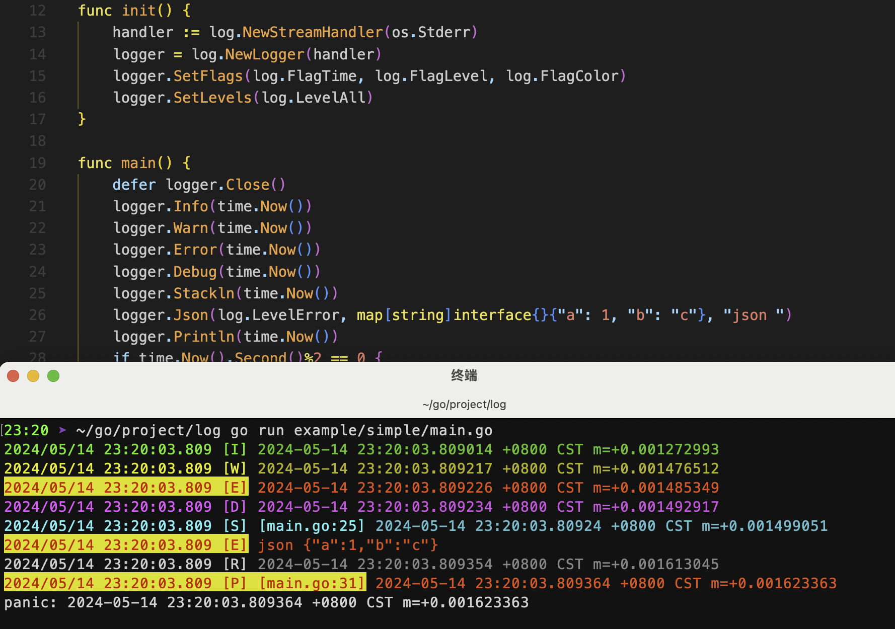

# log
> a golang log library



## Features
- `interface` 接口化，支持扩展
- `console` 支持控制台
- `file` 支持文件
- `cron` 支持定时任务（备份日志文件）
- `level` 分级
- `flag` 标记
- `color` 颜色

## 示例
``` go
func useConsole() log.ILogger {
	handler := log.NewStreamHandler(os.Stderr)
	logger := log.NewLogger(handler)
	// 设置显示Time、Level、Color
	logger.SetFlags(log.FlagTime, log.FlagLevel, log.FlagColor)
	// 设置需要打印的Level
	logger.SetLevels(log.LevelAll)
	// 更改LevelName
	logger.LevelRename(log.LevelInfo, "MyInfo")
	return logger
}
func useFile() log.ILogger {
	// 每个文件2M
	handler, _ := log.NewFileHandler("./output/logs/log", 1024*1e3*2)
	logger := log.NewLogger(handler)
	logger.SetFlags(log.FlagAll &^ log.FlagColor)
	logger.SetLevels(log.LevelError | log.LevelDebug | log.LevelStack)
	return logger
}
func useCron() log.ILogger {
	// 每5分钟备份一次
	handler, _ := log.NewCronHandler("./output/cron/log", "*/5 * * * *")
	logger := log.NewLogger(handler)
	logger.SetFlags(log.FlagAll & log.FlagColor)
	logger.SetLevels(log.LevelAll)
	return logger
}

func main() {
	var logger log.ILogger
    // logger = useConsole()
    // logger = useFile()
    logger = useCron()
	for {
		logger.Info("hello world! ")
		logger.Infof("It's %s\n", time.Now())
		logger.Infoln(time.Now())
		logger.Warnln(time.Now())
		logger.Errorln(time.Now())
		logger.Debugln(time.Now())
		logger.Stackln(log.DefaultDepth, time.Now())
		logger.Println(time.Now())
		logger.Json(log.LevelError, map[string]interface{}{"a": 1, "b": "c"}, "json ")
		// logger.Fatalln(time.Now())
		// logger.Panicln(time.Now())
		time.Sleep(time.Second / 100)
	}
}
```